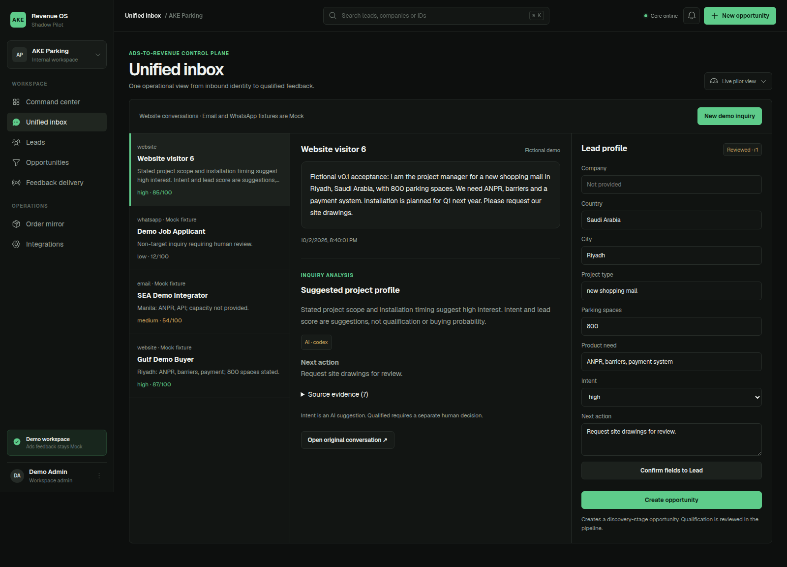
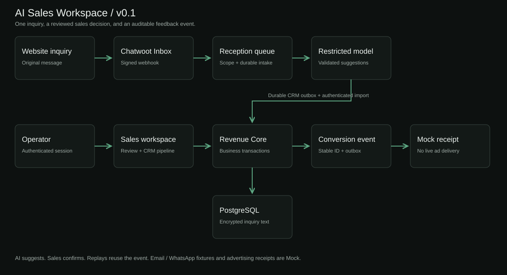
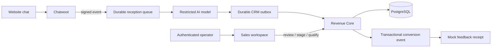

# AI Sales Workspace

**An overseas B2B inquiry becomes a reviewed Lead, a sales opportunity, and an auditable conversion event.**

[Online demo](https://demo.jayln3.my:8443/sales) · [Watch the video](https://demo.jayln3.my:8443/sales#walkthrough) · [Website inquiry](https://demo.jayln3.my:8443/) · [Operator workspace](https://demo.jayln3.my:8443/sales/workspace) · [Architecture](docs/ARCHITECTURE.md)

Export sales teams receive project requirements in conversation, then lose context while copying them into a CRM. Marketing sees the original lead but often misses the sales team's qualification decision. This project connects the message, evidence, human decision and feedback event in one traceable workflow.



## What you can demonstrate

1. Send a fictional parking project through the real website's Chatwoot widget.
2. See the original inquiry and a real model's structured analysis appear automatically in the workspace.
3. Review exact source evidence, preserve unknowns, and confirm fields to the Lead.
4. Create an opportunity and move its Kanban stage.
5. Confirm **Qualified** through explicit human checks.
6. Inspect one stable conversion event and its **Mock receipt**. Repeating the command does not create a second event.

The deployed website reception has a verified Codex-to-CRM path. Operator-created offline examples and the three seeded scenarios are explicitly labeled **Mock**. Email and WhatsApp fixtures do not claim connected accounts. Advertising feedback is **Mock**; no live ad-platform delivery or attribution is claimed. OKKI and Feishu receive no writes.

The public project page and video are available without login. Mutating CRM actions require the demo operator password. All published records and screenshots are fictional.

## Try it locally

Requires Node.js 24+ and npm, running in Linux/WSL.

```bash
npm ci
npm run build -w @ake/contracts
npm test
npm run dev:api
```

In a second shell, from the same repository:

```bash
npm run dev
```

Open `http://127.0.0.1:3000`, then **Open workspace**. The development default is an in-memory store and deterministic Mock analysis, with three fictional scenarios. Restarting this local default resets its data. No model key, private knowledge repository or advertising account is required.

Production builds require `WORKSPACE_PASSWORD` and a random `WORKSPACE_SESSION_SECRET` of at least 32 characters. Public deployments must use the PostgreSQL store, a field-encryption key, API authentication and the protected operator proxy. See [deployment and recovery](docs/DEPLOY_DEMO.md).

## Architecture





- Chatwoot owns messages and assignment; Revenue Core owns business transactions.
- The model proposes fields and cites evidence. It cannot qualify a Lead, change a deal stage or send advertising events.
- AI suggestions and human-confirmed fields are stored separately. Unknowns remain null; explicit zero remains zero.
- Opportunity creation and qualification are separate commands. Qualification updates the Lead, audit log, event and outbox in one transaction.
- Source messages, CRM Leads, opportunities and conversion events use distinct stable identifiers. Stage and review writes reject stale versions.
- The operator session is signed and expiring. The browser proxy allows only the relevant business routes and cannot access bridge imports or webhooks.

[Full architecture and database model](docs/ARCHITECTURE.md) · [Editable Mermaid source](docs/architecture.mmd)

## Three demo scenarios

| Scenario | Source | Expected analysis |
|---|---|---|
| Riyadh shopping mall, 800 spaces, ANPR/barriers/payment | Website fixture | High intent; company unknown; inferred country labeled |
| Manila integrator exploring ANPR/API | Email Mock | Medium intent; capacity and budget unknown |
| Job applicant with no buying project | WhatsApp Mock | Low intent / non-target |

[Fixture source](packages/contracts/src/demo-fixtures.ts). Scores demonstrate prioritization; they are not purchase probabilities.

## Verification

```bash
npm test
npm run typecheck
npm run build
npm run check:public
```

The store acceptance suite also runs against real PostgreSQL when `TEST_DATABASE_URL` points to an isolated, migrated test database. It checks concurrent intake, duplicate opportunity creation, explicit qualification, one event, stale stage updates, cross-workspace rejection, reviewed-field preservation and live-delivery rejection for fictional fixtures.

[Acceptance record](docs/V01_ACCEPTANCE.md) records the current online evidence and limitations. [Browser verification](scripts/smoke-workflow.py) exercises the operator workflow; [website verification](scripts/verify-live-website.py) starts at the actual widget and requires a real Codex analysis receipt.

## Repository map

| Path | Responsibility |
|---|---|
| `apps/workspace-web` | Public project page, login, Unified Inbox, review, Kanban and feedback ledger |
| `apps/revenue-core` | Ingestion, analysis, CRM transactions, PostgreSQL and delivery outbox |
| `packages/contracts` | Shared schemas, records and fictional fixtures |
| `deploy/demo` | Small-server overlay and restricted reception bridge |
| `scripts` | Reproducible build and acceptance checks |
| `docs` | Architecture, setup, recovery, evidence and demonstration |

The optional [Canonical knowledge integration](docs/REQUIREMENT_INTEGRATION.md), [read-only OKKI connector](docs/OKKI_IMPORT.md) and [larger pilot stack](docs/PILOT_RUNBOOK.md) remain available as reference modules. They are not required by this v0.1 demo.

## v0.1 boundary

One low-concurrency demo workspace, one project per conversation, human qualification and Mock advertising feedback. The next release can separately validate mailbox/WhatsApp connections and individual advertising adapters. Full ERP, billing, inventory, multitenant permissions and extra social channels are outside this release.
