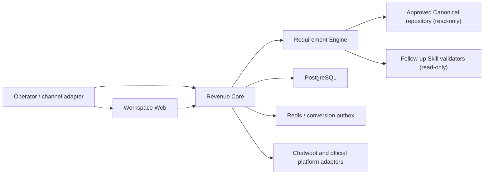

# AKE Revenue Intelligence

An open reference implementation that connects a revenue CRM, isolated requirement-mining service, approved local knowledge repository, Chatwoot, PostgreSQL, and idempotent advertising feedback.

The repository contains architecture and fictional fixtures only. It does not contain AKE's private knowledge repository, installed production Skill, credentials, customer records, chat messages, database dumps, or machine-local configuration.

## What is implemented

- Chatwoot webhooks for website chat and official WhatsApp Cloud API conversations.
- Meta Lead Ads, CTWA and website identifiers without fabricating Instant Form lead IDs.
- Google Lead Form `lead_id` deduplication with a separate `gcl_id`, plus website `gclid`, `gbraid` and `wbraid` capture.
- Lead, Person, Company, immutable attribution touch, Opportunity, stage history, order mirror schema, raw events and audit log.
- Transactional Opportunity → Lead qualified → domain event → conversion outbox flow.
- Meta and Google conversion adapters, mock-safe default, retries, DLQ, replay and separate delivery/diagnostic states.
- AI draft-only endpoint with `AI_AUTO_SEND=false`; ERP adapter endpoints are isolated behind provider configuration.
- Bounded, read-only OKKI connector for both active and converted (`archive=2`) inquiries; OKKI IDs never masquerade as advertising IDs.
- Next.js operations console and an isolated Docker Compose stack for local WSL development.
- Evidence-aware customer project state, encrypted append-only interactions and one-question progressive discovery backed by an externally mounted, read-only Canonical knowledge repository.
- A separate webhook-only Compose package for the small Ubuntu VPS; the full CRM never targets that host.

LinkedIn, TikTok, Messenger, Instagram, email, Won/Order/Payment feedback, WPPConnect and Baileys are intentionally outside the MVP acceptance boundary.

## Local WSL demo

Requires Node.js 24+.

```bash
cp .env.example .env
npm install
npm run test
npm run dev:api
```

In a second WSL shell:

```bash
npm run dev
```

Open `http://127.0.0.1:3000`. Memory storage, mock ads delivery and seeded pilot data are the local defaults.

### Isolated Docker demo

The full local stack uses project-scoped containers and volumes. PostgreSQL, Redis, Chatwoot and the CRM are not installed into the host. Copy `.env.production.example` to `.env.local`, generate every secret, and configure three absolute read-only mount roots:

- `AKE_KNOWLEDGE_ROOT`: an approved knowledge repository with `.qmd/index.sqlite`, `.qmd/index.yml`, and `30-canonical/`;
- `AKE_FOLLOWUP_SKILL_ROOT`: a compatible installed follow-up Skill exposing the validation scripts described in the integration guide;
- `QMD_PACKAGE_ROOT`: the local QMD package directory.

Then run:

```bash
docker compose --env-file .env.local -f compose.yaml -f compose.local.yaml up -d --build
docker compose --env-file .env.local -f compose.yaml -f compose.local.yaml ps
```

Local endpoints:

- CRM workspace: `http://127.0.0.1:3000`
- Chatwoot onboarding/inbox: `http://127.0.0.1:3001`
- Revenue Core health: `http://127.0.0.1:4100/health`

The requirement engine has no host port. Workspace Web and Revenue Core reach it only through the internal Docker network. See [CRM, database and intelligent requirement integration](docs/REQUIREMENT_INTEGRATION.md).

Caddy and the backup agent are behind the `production` profile and do not start during local development. Ads delivery is `mock`, AI auto-send is hard-disabled, and OKKI sync is disabled unless explicitly configured.

Stop the stack without deleting its local data:

```bash
docker compose --env-file .env.local -f compose.yaml -f compose.local.yaml down
```

## API

Revenue Core listens on port `4100`. The dependency-free OpenAPI 3.1 manifest is available at `/openapi.json`. The public webhook routes verify provider secrets and are intentionally exempt from the internal `x-api-key`; all `/api/v1/*` routes require the key when `API_AUTH_MODE=api-key`.

`POST /api/v1/requirements/analyze` links one stable inbound event to the CRM database, isolated requirement engine and read-only Canonical knowledge. `GET /api/v1/requirements/{leadId}` returns the resulting evidence-aware profile without exposing raw stored messages.

## Architecture



- Revenue Core is the only owner of CRM transactions.
- Requirement Engine has no database credentials or host port.
- Knowledge and Skill mounts are read-only; raw customer messages are encrypted before storage and are excluded from profile read APIs.
- Replaying the same stable event ID returns the prior receipt without duplicate side effects.
- `AI_AUTO_SEND=false` is a hard invariant.

See [integration architecture](docs/REQUIREMENT_INTEGRATION.md) for the API contract and isolation checks.

## Community review

Architecture reviews and maintained open-source integration suggestions are welcome. Please include:

- the concrete bottleneck or invariant affected;
- repository URL, license, current maintenance evidence, and stars;
- proposed adoption class: execution dependency, source reference, behavioral pattern, or do not adopt;
- smallest reversible proof of concept and its success/failure metrics.

Do not post customer data, secrets, private knowledge, local paths, or production screenshots.

## Deployment split

The 1 GB Ubuntu VPS receives only the lightweight webhook gateway in `deploy/webhook-only`. Chatwoot, PostgreSQL, Redis, Revenue Core/Worker and Workspace Web remain on the local or future full-size application host. See [Pilot runbook](docs/PILOT_RUNBOOK.md), [Chatwoot setup](docs/CHATWOOT_SETUP.md), and [OKKI read-only import](docs/OKKI_IMPORT.md).

```bash
docker compose -f deploy/webhook-only/compose.yaml config
docker compose -f deploy/webhook-only/compose.yaml up -d --build
```

Do not put the SSH password, API tokens or customer PII in the repository or logs.
