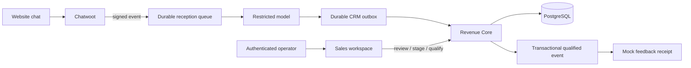

# Architecture and data ownership

The running v0.1 uses the existing Chatwoot website inbox, a restricted reception service, Revenue Core, the sales workspace and PostgreSQL. The optional Canonical knowledge service and larger reference stack remain documented separately in `REQUIREMENT_INTEGRATION.md`.

The full editable graph is [architecture.mmd](architecture.mmd).

## Boundaries

- **Chatwoot** owns original conversations, messages, assignment and human takeover. The bridge uses signed webhooks and the official API; Revenue Core does not query Chatwoot tables.
- **Reception** authenticates webhook timestamps/signatures, checks account and inbox scope, serializes calls and caps initial replies. The model cannot write CRM or advertising state. The existing demo permits at most two initial replies and stops on human takeover.
- **CRM outbox** retains an event until Revenue Core returns a saved inquiry and Lead ID. A CRM failure does not resend the visitor reply. Source message IDs remain stable on retry.
- **Revenue Core** owns the Lead, inquiry projection, human review, opportunity, stage history, conversion event and delivery ledger. Imported live analyses require both the API key and a separate bridge key.
- **PostgreSQL** persists the business workflow. Inquiry content uses AES-256-GCM when the required deployment field key is set. Operator APIs are authenticated; the public project page has no access to CRM records.
- **Workspace** uses a signed, expiring HttpOnly session, origin checks and an exact backend route allowlist. It cannot proxy bridge ingestion or public webhook routes.
- **Advertising** is Mock in this deployment. The immutable delivery mode prevents a stored Mock event from becoming live merely because environment configuration changes.

## Identity and idempotency

`conversationId`, source `eventId`, CRM `leadId`, `opportunityId` and `conversionEventId` are separate identifiers. A conversation maps to one inquiry project in v0.1; a new project should start a new conversation. An email match may reuse a Person but does not merge projects.

- Lead ingestion serializes a stable source key with a PostgreSQL transaction advisory lock.
- Repeated source messages return the same inquiry. Reusing an event ID with different text is rejected.
- Creating an opportunity locks its source Lead and returns the existing opportunity on repeat.
- Qualification is a separate human command. It locks the opportunity and Lead, then updates the business state, audit log, event and delivery in one transaction.
- Stage writes and reviewed fields use optimistic versions. Stale writes return a conflict and ask the operator to refresh.
- AI suggestions and confirmed fields are separate. A later model result never overwrites human-reviewed fields.

## Model behavior

Local fixtures and operator-created demo inquiries use an explicit deterministic Mock provider by default. The website reception path imports a real Codex result after schema validation. The API also offers a configurable OpenAI-compatible provider with a timeout, bounded input and validated output. Configuration presence is not reported as proof of a healthy live model.

Unknown fields remain null; zero remains zero. Evidence quotes must exist in the source message. Intent and score remain suggestions. Live model failure remains a failure with the original inquiry available for manual review, rather than silently changing to a successful Mock analysis.

## Data model

| Table | Purpose |
|---|---|
| `people`, `companies`, `channel_identities` | Contact identity and exact matches |
| `leads`, `attribution_touches`, `ad_identifiers` | Inquiry project, immutable source and distinct provider identifiers |
| `inbox_messages` | Encrypted inquiry projection, model result and processing state |
| `opportunities`, `opportunity_stage_history` | Sales pipeline and versioned changes |
| `conversion_events`, `conversion_deliveries` | Stable business event and delivery lifecycle |
| `audit_log` | Human/system actions and timestamps |

Migrations are additive and idempotent. The website, Inbox and existing non-demo services retain their original ports and data stores.
